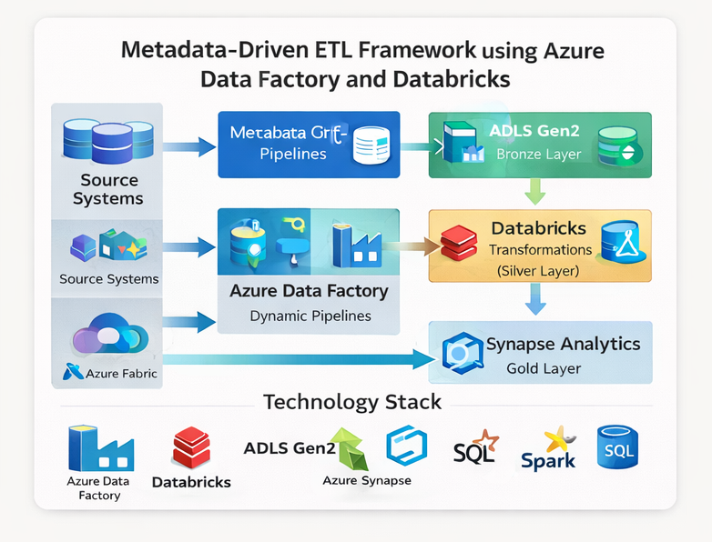

# Metadata-Driven ETL Framework using Azure Data Factory and Databricks

## Architecture Diagram

This project demonstrates a scalable metadata-driven ETL framework designed to automate ingestion and transformation pipelines across multiple enterprise data sources using Azure Data Factory and Azure Databricks.

The framework enables reusable and parameterized pipeline orchestration for efficient large-scale data processing.

---

## Architecture Flow

Source Systems
→ Metadata Configuration Tables
→ Azure Data Factory Dynamic Pipelines
→ ADLS Gen2 Bronze Layer
→ Databricks Transformations (Silver Layer)
→ Synapse Analytics Gold Layer

---

## Key Features

✔ Metadata-driven pipeline execution  
✔ Dynamic parameterized ingestion pipelines  
✔ Incremental data loading strategy  
✔ Reusable transformation workflows  
✔ Enterprise-scale orchestration design  

---

## Technology Stack

Azure Data Factory  
Azure Databricks  
ADLS Gen2  
Azure Synapse Analytics  
PySpark  
SQL  

---

## Use Case Scenario

Designed to automate ingestion from multiple structured and semi-structured sources using metadata configuration tables instead of hard-coded pipelines, improving scalability, maintainability, and operational efficiency.
